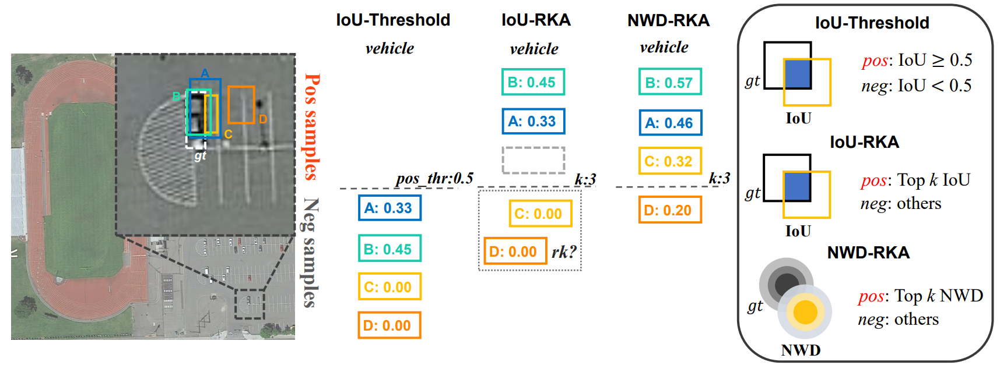

# TODbox
Official implementation of the paper: Detecting Tiny Objects in Aerial Images: A Normalized Wasserstein Distance and A New Benchmark

The annotations of **AI-TOD-v2**: https://drive.google.com/drive/folders/1Er14atDO1cBraBD4DSFODZV1x7NHO_PY?usp=sharing

The source code of the **NWD-RKA** please refer to the folder [mmdet-nwdrka](https://github.com/Chasel-Tsui/mmdet-aitod/tree/main/mmdet-nwdrka). 

## Introduction
The Normalized Wasserstein Distance and the RanKing-based Assigning strategy (NWD-RKA) for tiny object detection. 

A comparison between AI-TOD and AI-TOD-v2.

## Benchmark
Supported baselines for tiny object detection:
-[] baselines

Supported horizontal tiny object detection methods:
-[] DotD
-[] NWD-RKA

Supported oriented tiny object detection methods:
coming soon!

